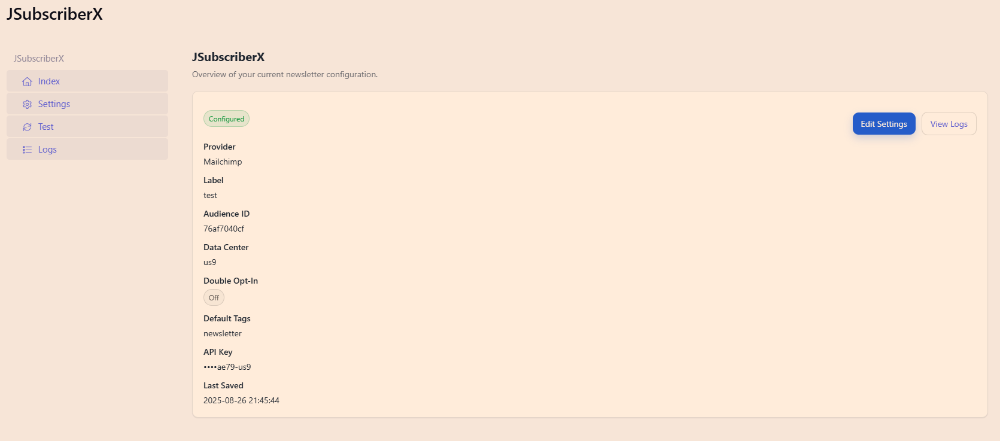
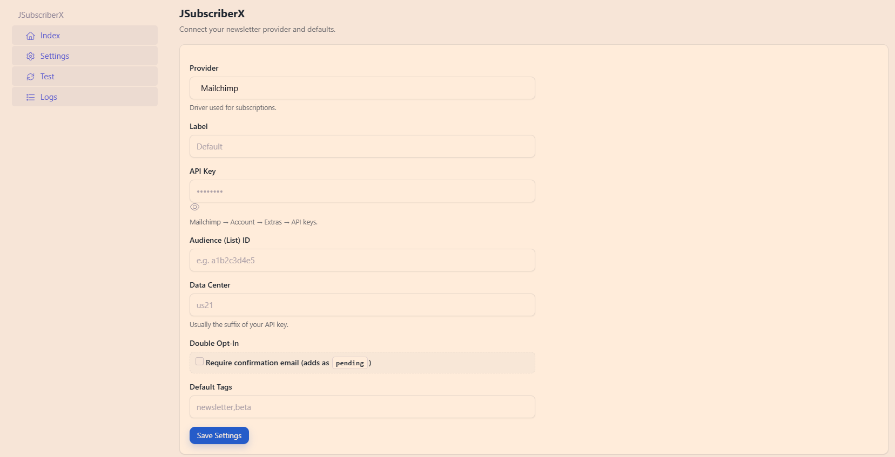
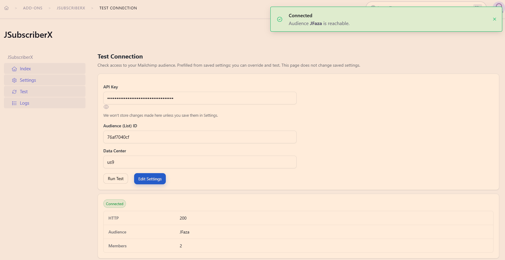
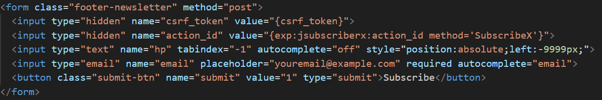

# JSubscriberX 1.0.0


Provider-agnostic newsletter subscriptions with Mailchimp driver.

**Author:** [Javid Fazaeli](https://fazaeli.dev)  
**ExpressionEngine newsletter subscription add-on**

---

## 🚀 Overview

JSubscriberX is a lightweight ExpressionEngine add-on for handling newsletter subscriptions.  
It’s built for flexibility, security, and easy integration with mailing services.

---

## 📷 Screenshots

### Control Panel Dashboard


### Settings Page


### Test Connection


### Logs
![Logs] (docs/images/logs.png)

---

## ✨ Features

- Secure form handling using ExpressionEngine Actions
- Encrypt/Decrypt functions to store API Keys
- Honeypot, CSRF
- **Double opt-in support** — normalized `pending` status and “check your inbox” messaging
- **Test connection** — quick provider health check from the CP or via an Action
- Clean, semantic form markup
- Works with AJAX/fetch() and classic POST forms

---

## 📦 Provider Support

- ✅ **Mailchimp** — built-in and fully supported
- 🔧 **Extensible architecture** — developers can register custom providers (e.g., SendGrid, SES, Listmonk) by implementing the same interface used by `subx->subscribe()`

**Example**

```php
// Default provider (Mailchimp) is bundled: 
$svc = ee('jsubscriberx:subx');
$res = $svc->subscribe( 'user@example.com', [ 'tags' => ['newsletter'] ] ); 
```
---

## 📄 Usage

You can submit to the add-on’s Action either via `action_url` (form action attribute) **or** a hidden `action_id` input.


### Option A — Hidden `action_id` input
`Recommended, since you have more control over the response`

```html
<form class="footer-newsletter" method="post">
  <input type="hidden" name="csrf_token" value="{csrf_token}">
  <input type="hidden" name="action_id" value="{exp:jsubscriberx:action_id method='SubscribeX'}">
  <input type="text" name="hp" tabindex="-1" autocomplete="off" style="position:absolute;left:-9999px;">
  <input type="email" name="email" placeholder="youremail@example.com" required autocomplete="email">
  <button class="submit-btn" name="submit" value="1" type="submit">Subscribe</button>
</form>
```


**Response:**
```
{success: true, status: 'subscribed', message: 'Already subscribed'}
```

### Option B — Form `action` URL
```html
<form class="footer-newsletter" method="post" action="{exp:jsubscriberx:action_url method='SubscribeX'}">
  <!-- CSRF protection -->
  <input type="hidden" name="csrf_token" value="{csrf_token}">

  <!-- Honeypot -->
  <input type="text" name="hp" tabindex="-1" autocomplete="off" style="position:absolute;left:-9999px;">

  <!-- Email input -->
  <input type="email" name="email" placeholder="youremail@example.com" required autocomplete="email">

  <!-- Optional redirect after success -->
  <!-- <input type="hidden" name="return" value="{path='newsletter/thanks'}"> -->

  <button class="submit-btn" name="submit" value="1" type="submit">Subscribe</button>
</form>
```

---

## ⚙️ Installation

1) Copy the add-on into your ExpressionEngine add-ons directory:

`/system/user/addons/jsubscriberx`


2) In the Control Panel: **Add-ons → Install JSubscriberX**  
3) Insert one of the example forms into your template(s)

---

## 🔧 Configuration

### Double Opt-In
If your provider/account enforces double opt-in, JSubscriberX normalizes the response to:

- `status: "pending"` with a message like “Check your inbox to confirm.”

No template changes are required—messaging is handled for you.


### Test Connection
Ensure provider credentials are configured (via env/config and/or add-on settings). Then:

- **Control Panel:** **Add-ons → JSubscriberX → Test Connection** (shows provider status/HTTP code)

### Return URL (optional)
Redirect users after a successful subscription:

```html
<input type="hidden" name="return" value="{path='newsletter/thanks'}">
```

---

## 🔁 Response Format (normalized)

On immediate subscribe:

```json
{ "success": true, "status": "subscribed", "message": "You are subscribed.", "http": 200 }
```

On double opt-in:
```json
{ "success": true, "status": "pending", "message": "Check your inbox to confirm.", "http": 202 }
```

On Honeypot:
```json
{ "success": true, "status": "ignored", "message": "", "http": 200 }
```

On provider error:
```json
{ "success": false, "status": "error", "message": "Invalid email", "http": 422 }
```

On MX Record check:
```json
{ "success": false, "status": "error", "message": "Email domain does not accept mail", "http": 422 }
```

---

## 🛡️ Anti-Spam (server-side honeypot)

```php
$honeypot = ee()->input->post('hp');
if (! empty($honeypot)) {
    return $this->respond(['success' => true, 'status' => 'ignored', 'message' => ''], 200, $isAjax);
}
```

---

## 🛠 Development

- PHP / ExpressionEngine **7+** compatible
- Uses EE **Action** flow
- Namespaced: `JavidFazaeli\JSubscriberX`
- Normalized response shape:
  - `success` (`true|false`)
  - `status` (`subscribed|pending|ignored|error`)
  - `message` (human-readable)
  - `http` (HTTP status code)

---

## 🤝 Contributing

PRs welcome:

1. Fork the repo
2. Create a branch: `feature/my-improvement`
3. Open a PR with a clear description

---

## 📜 License
This project is open-sourced software licensed under the [MIT license](LICENSE).

## Changelog 
See [CHANGELOG.md](CHANGELOG.md) for release history.

---

## 👨‍💻 Author

**Javid Fazaeli**  
- 🌐 https://fazaeli.dev  
- 📧 javid@fazaeli.dev  
- 🐙 https://github.com/jfaza
